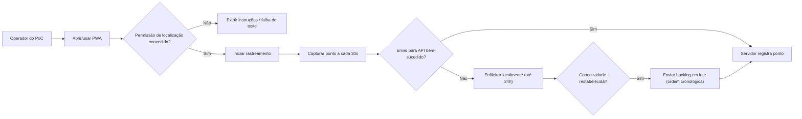

# Template de Documento de Requisitos de Produto (PRD)

## Visão Geral

Este PoC avalia a viabilidade técnica de substituir um app nativo por uma PWA que coleta a localização do usuário via GPS a cada 30 segundos e envia para um serviço de registro. Quando o dispositivo estiver offline (ou houver falha no envio), os pontos devem ser armazenados localmente e sincronizados posteriormente, preservando a ordem cronológica.

O resultado esperado é uma demo funcional e evidências (logs) sobre o que é ou não suportado em Android/Chrome e iOS/Safari, inclusive com a tela bloqueada.

## Objetivos

- Validar se uma PWA consegue capturar localização em intervalos fixos de 30s enquanto estiver em execução, incluindo em segundo plano e com tela bloqueada, nos alvos definidos.
- Validar persistência local e sincronização posterior de até 24h de pontos coletados quando offline.
- Validar ingestão no servidor e disponibilidade de dados para construir um gráfico de deslocamento (ordem cronológica preservada).

Métricas de sucesso (PoC)

- Taxa de coleta: >= 95% dos pontos esperados durante um teste contínuo de duração definida (por plataforma-alvo).
- Taxa de entrega: >= 99% dos pontos coletados são registrados no servidor após reconexão (dentro de janela definida).
- Integridade temporal: 100% dos pontos entregues em ordem cronológica (por `timestamp`) ou com ordenação determinística no servidor.

## Histórias de Usuário

- Como operador do PoC, eu quero iniciar e parar a coleta de localização para controlar o experimento.
- Como operador do PoC, eu quero visualizar o status (online/offline), quantidade de pontos pendentes e erros para avaliar o comportamento em cada dispositivo.
- Como sistema de registro, eu quero receber pontos de localização em ordem cronológica para permitir a geração de um gráfico de deslocamento.

## Diagrama de Casos de Uso

## Funcionalidades Principais

### 1) Coleta periódica de localização

Coletar localização em intervalos fixos e registrar evidências sobre limitações por plataforma.

Requisitos funcionais

- FR-01: A solução deve ser uma PWA (instalável) e ser testável em Android (Chrome) e iOS (Safari).
- FR-02: A PWA deve solicitar permissão de localização e informar ao operador quando a permissão impedir o teste.
- FR-03: A PWA deve tentar coletar a localização a cada 30s (intervalo fixo) enquanto estiver em execução, incluindo:
  - em primeiro plano
  - em segundo plano
  - com a tela bloqueada
- FR-04: Cada ponto de localização deve conter no mínimo: `timestamp` (UTC), `latitude`, `longitude` e `accuracy` (quando disponível).

### 2) Fila offline e sincronização posterior

A fila offline funciona como uma “caixa de saída”: quando não há internet, guarda; quando volta, envia.

Requisitos funcionais

- FR-05: A cada coleta, o sistema deve tentar enviar o ponto ao servidor; se falhar por ausência de internet ou erro de transporte, deve armazenar localmente.
- FR-06: Os pontos armazenados localmente devem persistir mesmo que o app seja fechado/reaberto durante o período de 24h (quando suportado pelo ambiente).
- FR-07: O sistema deve manter pontos não enviados por no máximo 24h; após esse prazo, deve descartar e registrar no log.
- FR-08: Ao restabelecer conectividade, o sistema deve sincronizar os pontos pendentes preferencialmente em lote.
- FR-09: A sincronização deve preservar a ordem cronológica dos pontos (por `timestamp`) ao enviar e/ou permitir ordenação determinística no servidor.
- FR-10: Em caso de falha na API (ex.: 5xx) o sistema deve executar tentativas de reenvio; caso o reenvio exceda a política definida ou o ponto expire (24h), deve descartar e registrar no log.
- FR-11: O sistema deve evitar duplicidade de pontos gerada por retries.

### 3) Serviço simples de registro (API)

Receber e armazenar pontos para verificação e geração de evidências do PoC.

Requisitos funcionais

- FR-12: O serviço de registro deve expor um endpoint para receber pontos (unitários ou em lote) sem autenticação (PoC).
- FR-13: O serviço deve persistir os pontos recebidos de forma que permita consulta posterior para validação.
- FR-14: O serviço deve registrar logs suficientes para auditoria do teste (recebimento, ordenação, duplicidade, rejeições).

### 4) Observabilidade para o PoC

Requisitos funcionais

- FR-15: A PWA deve exibir (ou permitir exportar) logs com:
  - último ponto coletado (timestamp)
  - última tentativa de envio e resultado
  - quantidade de pontos pendentes
  - eventos relevantes (offline/online, erros, descartes)

## Experiência do Usuário

- A experiência deve ser mínima e focada no teste: iniciar/parar rastreamento, status e logs.
- Requisitos de acessibilidade: informações críticas devem ser textuais (não apenas cor/ícone), com contraste adequado e compatibilidade básica com leitor de tela.

## Restrições Técnicas de Alto Nível

- O PoC deve testar exclusivamente a viabilidade em PWA (sem app nativo).
- Deve validar comportamento com tela bloqueada e em segundo plano nos navegadores alvo; diferenças entre plataformas são parte do resultado.
- Dados de localização são sensíveis: o PoC deve minimizar coleta fora do período de teste e manter retenção limitada (24h local).
- Não há autenticação no PoC; riscos de segurança/abuso são aceitos apenas em ambiente de teste.

## Fora de Escopo

- Login/autenticação, gestão de usuários e permissões avançadas.
- Visualização rica de mapa, histórico, relatórios e painéis.
- Requisitos de produção (hardening, escalabilidade, SLA, antifraude).
- Notificações push e rastreamento “sempre ativo” fora do ciclo do PoC.

## Questões em Aberto

- QA-01: Em iOS/Safari (e PWA instalada), qual é o comportamento real de coleta a cada 30s com app em segundo plano e tela bloqueada? Quais limitações impeditivas existem?
- QA-02: Qual política mínima de retry é desejada antes de descartar (número de tentativas e janela), além do limite de 24h?
- QA-03: Qual identificador simples deve existir para correlacionar testes no servidor (ex.: `sessionId`)?
